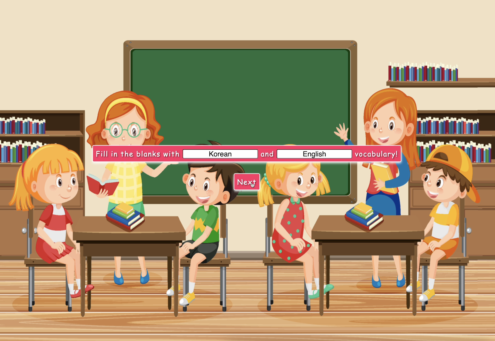
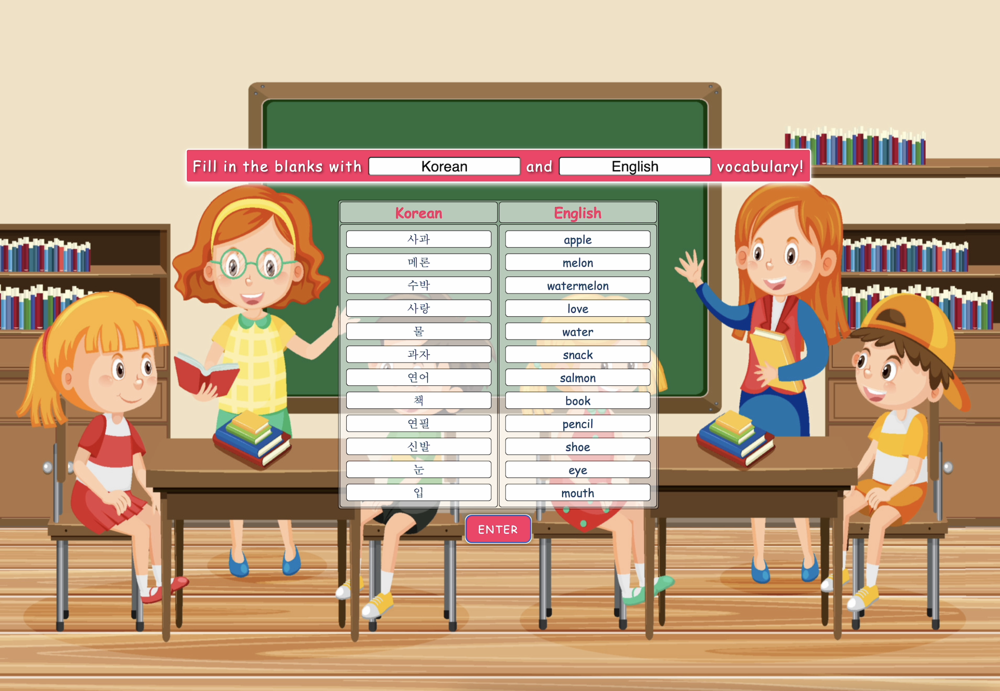
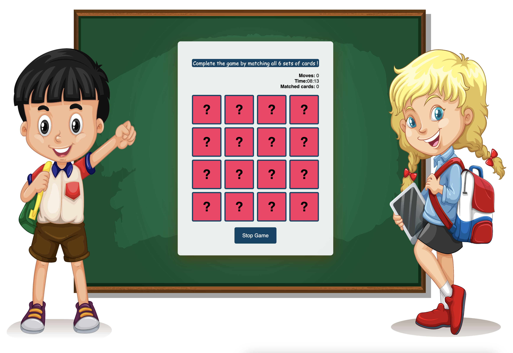
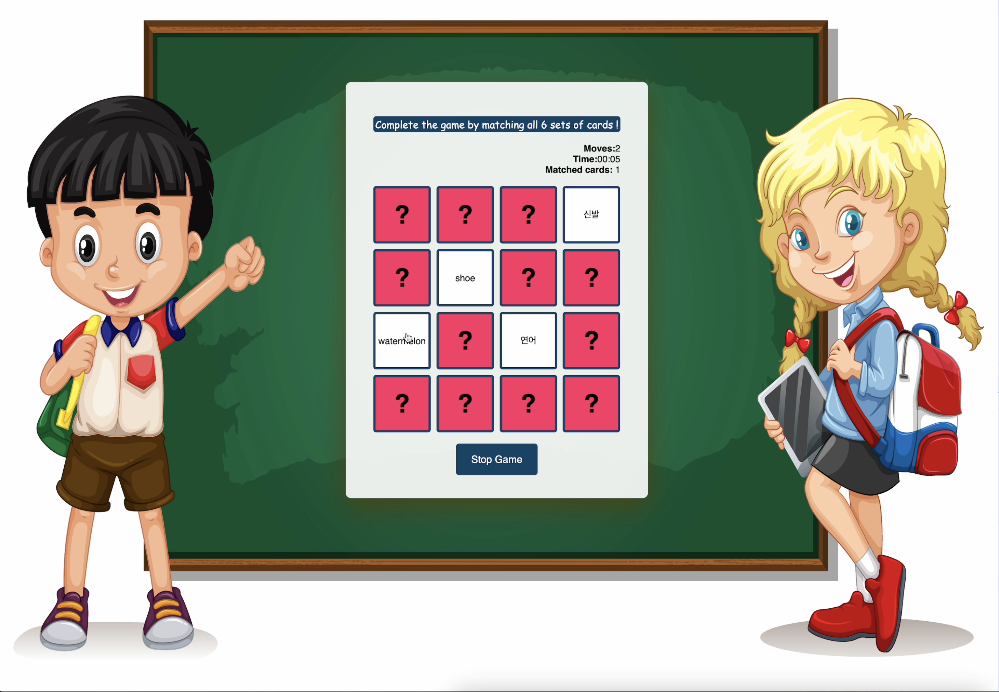
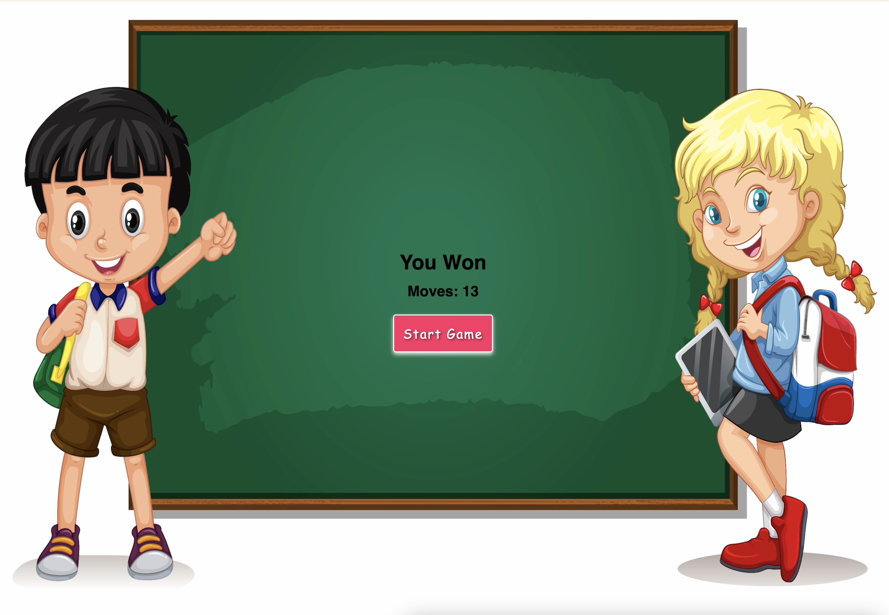

# FLIP
•  As an English tutor, I needed a tool to input custom vocabulary and create engaging educational games. Since most existing language online games offer preset words, I developed FLIP from scratch using HTML, CSS, and JavaScript
  
• Developed a dynamic UI that allows users to input unlimited words and interact with them through flipping cards  
• Integrated a timer using setInterval to monitor game duration 
• Implemented an algorithm to shuffle cards and randomize their grid positions, ensuring a unique layout for each game 

## Table of Contents

- [How to Play](#how-to-play)
- [Game Preview](#cGame-Previewg)
- [Let's play FLIP](https://loafcheck.github.io/FLIP/)

## How to Play

Follow these steps to enjoy the Memory Matching Game:

1. **Start the Game:**
   - Click on the "Start" button to initiate the game.

2. **Flip Cards:**
   - Click on any card to reveal its content.

3. **Match Pairs:**
   - Match pairs of cards with identical content.

4. **Win the Game:**
   - Successfully match all pairs to win the game.

5. **Keep an Eye on Moves:**
   - Pay attention to the number of moves made.

6. **Challenge Yourself:**
   - Aim to complete the game with the fewest moves possible.

## Game Preview

## Let's Play FLIP
[Let's play FLIP](https://loafcheck.github.io/FLIP/)
